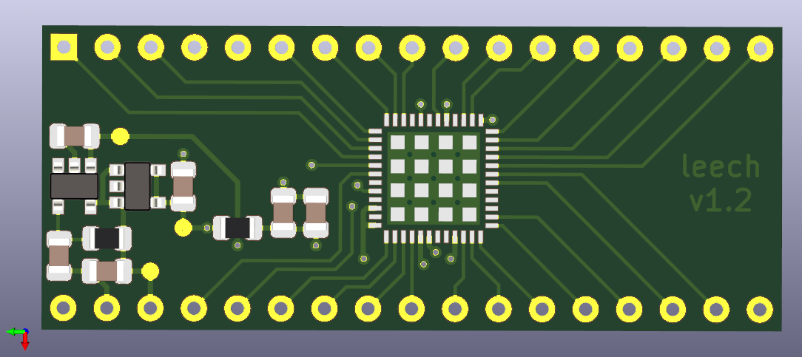
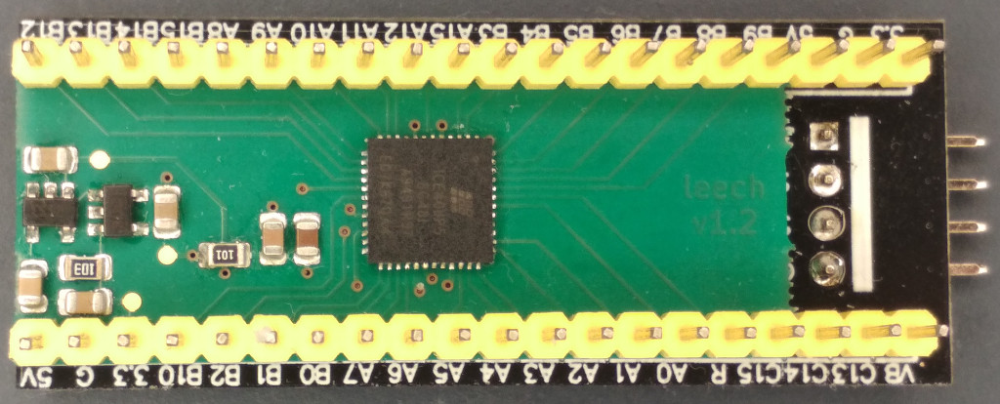

# Leech

An extension board with iCE40UP5k for the STM32F411 "Black Pill" board.

This project is based on the [icepill] project by [Adam Greig].
Some of the footprints were also taken from the icepill project.

This schematic and PCB design are licensed under the
Creative Commons [CC0 public domain dedication].
It is provided with no warranty.

[icepill]: https://github.com/adamgreig/icepill
[Adam Greig]: https://github.com/adamgreig
[CC0 public domain dedication]: https://creativecommons.org/publicdomain/zero/1.0/

## Revision History

### 1.2: 2020-11-13

* First version.
* Errata:
    * Drill diameter of 2.54mm connector pads is too small.
